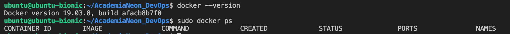

# Configurar Ambiente para Projeto Integrador - Curso DevOps - Academia Neon
Preparar um ambiente equalizado para o Projeto Integrador da Academia Neon do Curso DevOps. Como cada uma das integrantes do grupo tinham setups diferentes para realizar o trabalho, optamos por construir um mesmo ambiente para todas. Também percebemos que utilizando o vagrant + virtualbox + vscode além de ficar mais fácil de trabalhar, ficava mais leve que criar uma vm com interface gráfica direto no virtual box.

## Softwares Necessários
Para criação do ambiente, vamos utilizar os seguintes itens: [Vagrant](http://vagrantup.com/) + [VirtualBox](http://virtualbox.org/) + [VSCode](https://code.visualstudio.com/). Antes de mais nada será necessário baixar e instalar cada um deles.

## Setup
1. Realizar o clone desse projeto na sua pasta de trabalho.

2. Abrir o VSCode e via terminal acessar pasta de trabalho.
  2.1 Comandos MacOS - Neste exemplo, a pasta de trabalho é o home do usuário.
       * `$ cd ~/AcademiaNeon_DevOps `
       * `$ pwd `
         Exemplo resultado: /home/user/AcademiaNeon_DevOps 
       * `$ ls AcademiaNeon_DevOps`
         Exemplo resultado: LICENSE       README.md       ansible.cfg         desktop-devops       install_ansible.sh  inventory       playbooks
    
    2.2 Comandos Windows - Neste exemplo, a pasta de trabalho é desktop do usuário
       * `PS C:\> cd Users\NomeUsuario\Desktop\AcademiaNeon_DevOps `
       * `PS C:\Users\NomeUsuario\Desktop\AcademiaNeon_DevOps> dir `
          Deve listar todas as pastas e aqrquivos como no Linux.     

3. Acessar a pasta desktop-devops. Criar a VM Linux. Acessar via ssh. Setar usuário ubuntu. 
  3.1 Comandos MacOS
     Acessar a pasta:   
     * `$ cd desktop-devops`

     Criar/Subir a vm: 
     * `$ vagrant up `

       

     Validar status vm:
     * `$ vagrant status `   

        

     Desligar a VM
     * `$ vagrant suspend `

     Conectar na VM via ssh
     * `$ vagrant ssh `

       

       

     Mudar para usuário ubuntu - Veja que nesse item já estamos logados na vm criado pelo arquivo Vagrantfile
     * `vagrant@ubuntu-bionic:~$ sudo su - ubuntu `

       

    3.2 Comandos Windows
     Acessar a pasta:   
     * `PS C:\Users\NomeUsuario\Desktop\AcademiaNeon_DevOps> cd desktop-devops`

     Criar/Subir a vm:
     * `PS C:\Users\NomeUsuario\Desktop\AcademiaNeon_DevOps\desktop-devops> vagrant up `

     Validar status vm:
     * `PS C:\Users\NomeUsuario\Desktop\AcademiaNeon_DevOps\desktop-devops> vagrant status `

            

     Desligar a VM
     * `PS C:\Users\NomeUsuario\Desktop\AcademiaNeon_DevOps\desktop-devops> vagrant suspend `

     Conectar na VM via ssh
     * `PS C:\Users\NomeUsuario\Desktop\AcademiaNeon_DevOps\desktop-devops> vagrant ssh `

       

       

     Mudar para usuário ubuntu - Veja que nesse item já estamos logados na vm criado pelo arquivo Vagrantfile
    * `vagrant@ubuntu-bionic:~$ sudo su - ubuntu `

       

    <b>Importante</b>: Uma vez criada a vm, sempre que desligar, ao precisar utilizar novamente, basta executar o mesmo procedimento.    

## Instalar Ansible
Efetuar o clone do repositório dentro da vm criada.
* `$ git clone https://github.com/andresavs/AcademiaNeon_DevOps.git `

  

Executar a instalação do Ansible.
* `$ bash install_ansible.sh `

Testar Instalação 
* `$ ansible --help ` 
* `$ ansible local -m ping `

Validar Versão - Ansible 2.9.7 
* `$ ansible --version `

  

## Configuração Geral + Configurar Ansible
Atualizar pacotes linux, instalar programas (java, python, awscli) e suas dependencias. 
* `$ ansible-playbook playbooks/config-all.yml `

  

Configurar o Ansible.
* `$ ansible-playbook playbooks/config-ansible.yml ` 

  

Validar versão do Python 
* `$ ansible --version `
O Python precisa estar como 3 ou superior. Caso ainda não esteja é necessário sair do usuário ubuntu (exit) e sair da VM (exit). E logo após fazer a conexão ssh novamente e validar.

  

Validar instalação do AWSCLI
* `$ aws `

  

## Instalar Docker
O docker local não é pré-requisito para o projeto, mas se quiser instalar para utilizar esta vm para estudar, segue orientações.
* `$ ansible-playbook playbooks/install-docker.yml ` 

Validar Instalação
* `$ docker --version `  
* `$ docker ps ` 

  

Caso o docker ps dê algum erro, sair do usuário ubuntu e da vm. E logo após fazer a conexão ssh e validar, como foi feito para a validação do python.

## Instalar Jenkins
O Jenkins local também não é pré-requisito para o projeto, mas se quiser instalar para utilizar esta vm para estudar, segue orientações.
   * `$ ansible-playbook playbooks/install-jenkins.yml ` 

Validar Instalação
   * `$ sudo service jenkins status ` 

  

Comandos Úteis
   * Validar status do serviço Jenkins: `$ sudo service jenkins status ` 
   * Validar iniciar serviço Jenkins: `$ sudo service jenkins start` 
   * Validar parar serviço Jenkins:`$ sudo service jenkins stop ` 

## Configurar AWSCLI
Para ter acesso aos recursos da aws via linha de comando em nosso desktop de trabalho é necessário configurar as credenciais do seu usuário. Caso queira, por favor, seguir os passos descritos abaixo:

 1. Caso não tenha ainda será necessário criar uma conta na [AWS](https://portal.aws.amazon.com/billing/signup#/start). 

      <b>Importante</b>: Após criar a conta, sempre fazer o login com o root user.

 2. Acessar o console da AWS com o user root e ir em:

      * My Security Credentials → Access keys (access key ID and secret access key) → Create New Access Key

      
       <b>Importante</b>: Fazer o download das informações.

 3. Configurar o AWS CLI
    
    Preencher com as keys da AWS. Colocar a região de trabalho (a us-east-1 é a mais economica no momento) e o formato por padrão é json, mas você pode colocar também.

     * `$ aws configure `

       

    <i>AWS Access Key ID [None]: AWSAccessKeyId</i>           
    <i>AWS Secret Access Key [None]: AWSSecretKey</i> 
    <i>Default region name [None]: us-east-1</i> 
    <i>Default output format [None]: json</i>   

 4. Alguns comandos para testar:
     * `$ aws iam list-access-keys` 
     * `$ aws ec2 describe-regions`

## Dicas 
Para resolver problemas de horário entre VM e EC2 efetuar os comandos abaixo, sair do usuário ubuntu e da vm. E logo após fazer a conexão ssh.
   * `$ sudo apt install ntpdate `
   * `$ sudo ntpdate -u pool.ntp.org `

